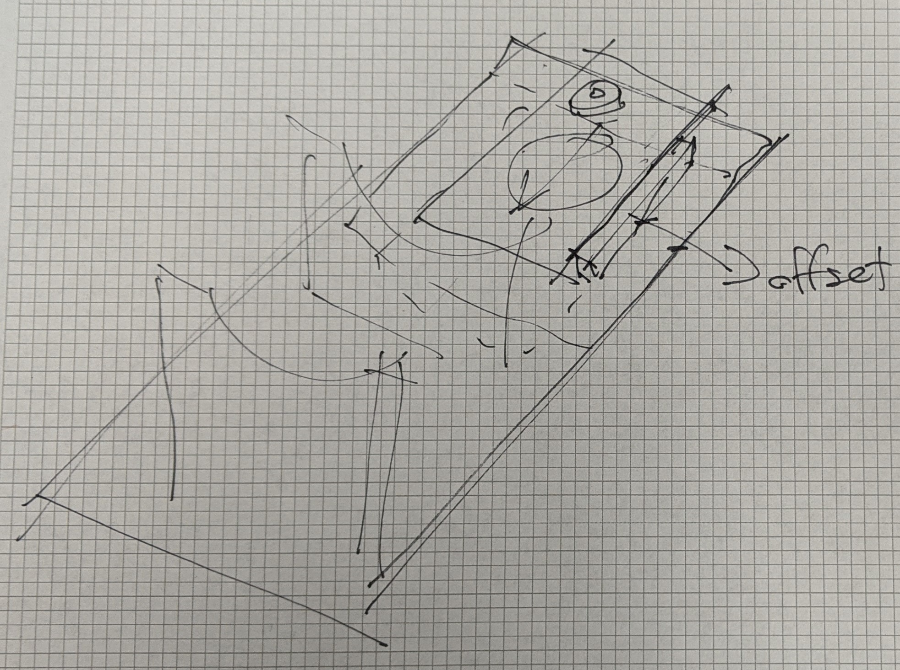

# Apollo Sky Capture Hardware - Documentation and code

Capture Device Details
Here are some additional details how to build your own capture device.

| **Roof setup**  | **Radiance Scanner**  |
|---|---|
|   |   |

**Arduino Wiring for Control**

| **Metal Plate Machined**  | **Metal Plate Top**  |
|---|---|
|   |   |

**Mounting Plate Sketch**
This was an early phase design visualization of the Mounting plate by Kevin Pratt. We used this sketch to machine the plate.

| **Mounting Plate Diagram**  | **Plate Compass Top**  |
|---|---|
|   |   |

**Device Sketch**
This was an early phase design visualization by Kevin Pratt.
